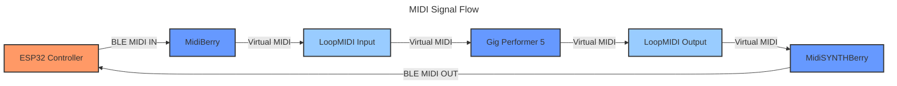

# BLE MIDI Foot Controller with Display Interface

A versatile Bluetooth Low Energy (BLE) MIDI foot controller built with ESP32 and FastLED, featuring HDMI display output and future Raspberry Pi integration capabilities.

 

## 🎯 Features

- **10 Programmable Footswitches**
  - Short press and long press functionality
  - Customizable MIDI note assignments
  - Debounce protection for reliable triggering

- **RGB LED Feedback**
  - Individual RGB LED for each footswitch
  - Visual BPM sync indicator
  - Customizable color mapping for different functions

- **Display Interface**
  - HDMI output for visual feedback
  - Compatible with Windows 11 display
  - Future Raspberry Pi UI integration planned

- **Wireless MIDI**
  - Bluetooth Low Energy MIDI connectivity
  - Windows 11 compatible via MidiBerry and WindSYNTHBerry
  - Tested with Gig Performer 5
  - Low latency performance

- **Real-time BPM Sync**
  - Visual tempo indication
  - Automatic sync with DAW tempo

## 🛠️ Hardware Requirements

- ESP32 Development Board
- 10x Momentary Footswitches
- WS2812B LED Strip (10 LEDs)
- Power Supply (5V)
- HDMI Display
- Enclosure
- Resistors and wiring components

## 💻 Software Requirements

- **Windows 11**
  - MidiBerry (for BLE MIDI connectivity)
  - WindSYNTHBerry (for MIDI routing)
  - Gig Performer 5 (for MIDI programming)
  - LoopMidi (for MIDI routing)

## 🎸 Live Rig Setup

- Dell G5 laptop running Windows 11
- Behringer audio interface
- HDMI display for visual feedback
- Neural DSP Archetype Cory Wong plugin
- Gig Performer 5 for MIDI control

## 🎛️ Gig Performer 5 Integration

The foot controller works in tandem with Gig Performer 5 to create a bidirectional control system:


1. **Button Press Flow**
   - Physical button press sends MIDI message
   - GP5 receives and mirrors the button state
   - GP5 triggers the corresponding plugin parameter
   - GP5 sends feedback to control LED states

2. **Current Setup**
   - Modified version of NDSP Archetype Cory Wong preset
   - Bidirectional MIDI feedback for accurate LED states
   - Custom rackspaces for different song sections
   - Real-time visual feedback via HDMI display

3. **Control Mapping**
   - Each footswitch is mapped to corresponding GP5 widgets
   - LED states reflect actual plugin parameters
   - BPM sync between controller and GP5
   - Instant preset switching for live performance

The complete Gig Performer 5 project file is available in the repository: [NDSP-Archetype-Cory Wong-adapted_by_gabriel.gig](https://github.com/bielaltoe/bluetooth-midi-foot-controller/blob/main/GigPerformer5/NDSP-Archetype-Cory Wong-adapted_by_gabriel.gig)

## 📋 Pin Configuration

| Component | Pin |
|-----------|-----|
| LED Data  | 19  |
| Switch 1  | 13  |
| Switch 2  | 14  |
| Switch 3  | 25  |
| Switch 4  | 32  |
| Switch 5  | 17  |
| Switch 6  | 12  |
| Switch 7  | 21  |
| Switch 8  | 33  |
| Switch 9  | 4   |
| Switch 10 | 27  |

## 🔧 Installation

1. **Required Libraries**
   ```bash
   # Install the following libraries through Arduino Library Manager
   - FastLED
   - BLE-MIDI
   ```

2. **Hardware Setup**
   - Wire the footswitches to the corresponding GPIO pins
   - Connect the LED strip to data pin (19)
   - Connect HDMI display
   - Ensure proper power distribution

3. **Software Installation**
   - Clone this repository
   - Open `blw_midi_v3.ino` in Arduino IDE
   - Select your ESP32 board
   - Upload the code
   - Install MidiBerry and WindSYNTHBerry on Windows 11

## ⚡ Usage

1. Power on the device
2. Connect HDMI display
3. Open MidiBerry and WindSYNTHBerry
4. Look for "Gabriel's Foot Controller" in your MIDI device list
5. Configure MIDI routing in WindSYNTHBerry.
6. Set up your controls in Gig Performer 5 (this will be explained in the next section)
7. The built-in LED will indicate connection status
8. Short press: Sends MIDI notes on Channel 1
9. Long press (>2s): Sends MIDI notes on Channel 2.
## 🎨 LED Color Configuration

Current color mapping for MIDI notes:
```cpp
{0, Pink}        // RGB(255, 0, 180)
{1, Blue}        // RGB(73, 73, 255)
{2, Green}       // RGB(63, 210, 63)
{3, Yellow}      // RGB(200, 200, 56)
{4, White}       // RGB(91, 119, 256)
{5, Light Blue}  // RGB(0, 256, 179)
{6, Light Green} // RGB(68, 256, 68)
```

## 🔄 MIDI Implementation

- **Note Range**: 34-43 (configurable)
- **Channels**: 
  - Channel 1: Short press
  - Channel 2: Long press
- **Control Changes**:
  - CC 123: BPM MSB
  - CC 124: BPM LSB

## 🚀 MIDI Signal Flow



### Detailed Signal Path

1. **Input Flow**
   - ESP32 sends MIDI messages via Bluetooth LE
   - MidiBerry receives BLE MIDI signals
   - LoopMIDI creates virtual MIDI port
   - Gig Performer 5 receives MIDI through virtual port

2. **Output Flow**
   - Gig Performer 5 sends MIDI feedback
   - LoopMIDI routes signals to MidiSYNTHBerry
   - MidiSYNTHBerry sends BLE MIDI back to ESP32
   - ESP32 updates LED states based on received signals

### Connection Setup Screenshots

*MidiBerry input configuration showing ESP32 connection*


*MidiSYNTHBerry output routing configuration*


*LoopMIDI virtual port configuration*

## 🎛️ Gig Performer Integration
Gig Performer 5 project file is available in the repository: [FILE](https://github.com/bielaltoe/bluetooth-midi-foot-controller/blob/main/GigPerformer5/NDSP-Archetype-Cory Wong-adapted_by_gabriel.gig)

My Gig Performer 5 project is a modified version of the [NDSP-Archetype-Cory Wong](link). 

### Plugin Interface

*Neural DSP Archetype Cory Wong plugin interface in Gig Performer 5*

### Control Mapping

*Footswitch to parameter mapping diagram*

### MIDI Assignments
```
Footswitch 1: Note 34 - Drive On/Off
Footswitch 2: Note 35 - Compressor On/Off
Footswitch 3: Note 36 - Chorus On/Off
Footswitch 4: Note 37 - Delay On/Off
Footswitch 5: Note 38 - Reverb On/Off
...
```


## 🚀 Future Development

### Generalization of the Platform
The goal is to transform this project into a versatile MIDI control solution that can be adapted for various performance scenarios:

1. **Multi-Instrument Support**
   - Electric/Acoustic Guitar Effects
   - Keyboard/Synthesizer Control
   - DJ Controller Integration
   - Drum Machine Programming
   

2. **Modular Hardware Design**
   ```mermaid
   graph TD
       Core[Core Module ESP32] --> A[Guitar Module]
       Core --> B[Synth Module]
       Core --> C[DJ Module]
       Core --> D[Custom Module]
       
       classDef module fill:#f96,stroke:#333,stroke-width:2px;
       class A,B,C,D module;
   ```

5. **Planned Features**
   - Raspberry Pi app for remote configuration.
   - Integration with [MIDI_FOOT_UI](https://github.com/bielaltoe/MIDI_FOOT_UI) for enhanced visual feedback

6. **Hardware MIDI Integration**
   - Direct MIDI hardware connectivity without computer bridge
   - Support for traditional 5-pin DIN MIDI connections
   - Standalone operation for guitar pedals and multi-effects units
   - Built-in MIDI routing and processing
   - Hardware MIDI thru functionality
   ```mermaid
   graph LR
       Controller[ESP32 Controller] -->|Direct MIDI| Hardware[MIDI Hardware]
       Controller -->|MIDI Thru| Additional[Additional MIDI Devices]
       
       classDef hardware fill:#f96,stroke:#333,stroke-width:2px;
       class Controller,Hardware,Additional hardware;
   ```

### Target Applications
1. **Music Production**
   - Professional recording studios
   - Home studio setups
   - Live performance venues

2. **Education**
   - Music schools
   - Sound design workshops
   - Interactive installations

3. **Entertainment**
   - Theater productions
   - Live events
   - Interactive art installations

4. **Custom Solutions**
   - Specific industry requirements
   - Specialized control interfaces
   - Integration with existing systems


## 🛠️ Technical Details

- Uses FreeRTOS for multi-core operation
- MIDI processing on Core 1
- LED handling on Core 0
- 50ms debounce delay
- 2000ms long-press threshold

## ⚠️ Current Limitations

- To use this controller with MIDI-compatible guitar pedals or multi-effects units, you'll need a BLE MIDI-capable device (like a computer running MidiBerry) to act as a bridge between the controller and your MIDI hardware
- Direct connection to traditional MIDI hardware is not yet supported
- Integration with [MIDI_FOOT_UI](https://github.com/bielaltoe/MIDI_FOOT_UI) is planned for future releases and will include:
  - Direct MIDI hardware connectivity
  - Standalone operation without a computer
  - Enhanced visual feedback and configuration options

## 🤝 Contributing

Contributions are welcome! Please feel free to submit a Pull Request.

## 📝 License

This project is licensed under the MIT License - see the [LICENSE](LICENSE) file for details.

## 📞 Contact

For questions and support, please [open an issue](https://github.com/bielaltoe/bluetooth-midi-foot-controller/issues) on GitHub.

---
